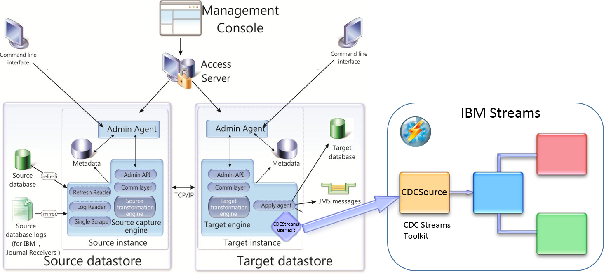

# About the CDC Streams toolkit
InfoSphere Data Replication Change Data Capture (CDC) is a replication solution that captures changes as they happen, and delivers them to target databases, message queues or flat files. CDC Replication provides low impact and fast delivery of data changes for the selected tables on the source side (source engine) and delivers them to a target that also has CDC installed (target engine).

The CDC Streams toolkit intercepts the CDC target engine's apply mechanism to allow transactions to be fed into an IBM Streams application. This is done through a Java user exit which is implemented at the table level and at the subscription level.

The java user exit can be installed on any CDC database (DB2, FlexRep, Oracle, SQL Server, etc.) engine and CDC Event Server. If your CDC topology does not have a CDC database Java engine, you can use CDC FlexRep or CDC Event Server to receive the database changes from the source engine and invoke the user exit.

**Note:** Although you have a choice, we would recommend to install an open source "free" database such as MySQL or Derby and use FlexRep instead of Event Server. When using Event Server, you have no access to the tables in the database which could make maintenance difficult. Also, the CHCCLP scripting language does not support CDC Event Server, which means that you can only use an exported subscription XML document to parse the tuples in the CDCParse operator.

When the subscription starts, the subscription-level `CDCStreams` user exit connects to the Streams application's `CDCSource` operator. As inserts, updates and deletes on tables are replicated by the subscription, the `CDCStreams` user exit converts them into a CSV format that is understood by the `CDCSource` Streams operator and subsequently transmits them. When the subscription arrives at the end of a logical unit of work (commit), the `CDCStreams` subscription-level user exit sends a "commit" record to the `CDCSource` operator, which can then be handled by any of the downstream operators. The subscription-level user exit also controls the advancement of the subscription's bookmark, which is done via a "handshake" with the CDCSource operator. See [Using the CDCStreams toolkit](Usage.md) for configuring the behaviour of the user exit. 

