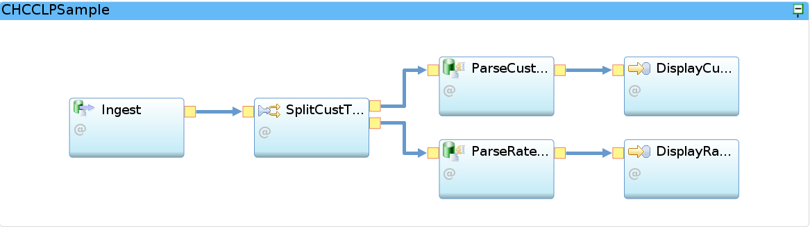

# Creating your Streams application
You can create your Streams application by creating a SPL Application Project in Streams Studio, making sure that the  `Dependencies` include the `com.ibm.streamsx.cdc` toolkit. Alternatively, you can import one of the sample applications that are provided as part of the CDC toolkit through File --> Import --> Sample SPL Application.

Two sample applications have been provided as part of the toolkit, `CHCCLPSample` and `ExportedXmlSample`. Both applications receive changes via the `CDCSource` operator, then use a `Split` operator to direct the raw tuples to the designated `CDCParse` operator, after which the output is sent to `/dev/stdout`.

`CHCCLPSample` application:


The `CDCSource` operator starts a TCP/IP listener, listening on port `12345`:


```
   stream<cdcDataT> Ingest = CDCSource()
     {
       param
         port : 12345 ;
     }
```

CDCSource requires the output tuple type to be `cdcDataT`, which separates the metadata into a `cdcMetadataT` tuple type from the `data`.

```
type cdcMetadataT = rstring txTableName, rstring txTimestamp, rstring txId,
	rstring txEntryType, rstring txUser ;
type cdcDataT = cdcMetadataT cdcMetadata, rstring data;
```
Subsequently, the `Split` operator directs the raw tuples to the designated output port. The output port is dynamically determined from the `etc/TableMapping.txt` file.

```
		(stream<cdcDataT> SplitCustThreshold ; stream<cdcDataT> SplitRatedCdr) =
			Split(Ingest)
		{
			param
				file : "etc/TableMapping.txt" ;
				key : txTableName ;
		}
```

These are the contents of the `etc/TableMapping.txt` file:

```
default,-1
"\*\*\*INITIALIZE\*\*\*",0,1
"TELCO.CUST_THRESHOLD",0
"TELCO.RATED_CDR",1
```
Data tuples from the `TELCO.CUST_THRESHOLD` table are directed to output port 0 and those from `TELCO.RATED_CDR` go to output port 1. A special tuple type, `\*\*\*INITIALIZE\*\*\*` is directed to both output ports. This tuple is sent by the `CDCStreams` user exit when the subscription is started and the `CDCParse` operator uses this (re-)read the table mapping metadata from CDC.

The application provides 2 `CDCParse` operators, one for tuples coming from `TELCO.CUST_THRESHOLD` and another one for `TELCO.RATED_CDR`.

```
		stream<cdcMetadataT cdcMetadata, rstring MSISDN, rstring NAME,
			rstring MAX\_MONTHLY\_CHARGE, rstring THRESHOLD_PERCENTAGE>
			ParseCustThreshold = CDCParse(SplitCustThreshold)
		{
			param
				separator : "\\|" ;
				accessServerConnectionDocument : "etc/AccessServerConnection.xml" ;
				dataStore : "CDC_DB2" ;
				subscription : "STRDB2" ;
				qualifiedTableName : "TELCO.CUST_THRESHOLD" ;
				fillDeleteAfterImage : true ;
		}
```


