# Getting started

## Initial configuration
The behaviour of the CDC Streams user exit is determined by the settings in `CDCStreams.properties` file, which is kept in the `CDCStreamsUserExit` folder. You can create multiple properties files and refer to them as a parameter in the subscription-level user exit. The user exit will first look for the properties file in the CDC engine's classpath (which has been enhanced with the `CDCStreamsUserExit` directory). If the specified properties file is not found in the classpath, the user exit will try to load it from the current directory, which is the _cdc-home_ directory.

The most-important parameters to configure in the CDCStreams.properties file are:
* `outputType`: Specifies the target of the user exit. For the tightest integration between CDC and Streams, we recommend to set this parameter to "cdcsource"; this causes the user exit to try to connect to the toolkit's CDCSource operator
* `tcpHostPort`: Host name (or IP address) and port that the Streams application is listening to. This parameter applies when the outputType is cdcsource or tcpsource only
* `handshakeAferMaxTransactions`: When the transaction volume of the source tables is high, doing a handshake for every logical unit of work (transaction) is inefficient. Together with the `handshakeAfterMaxSeconds` property, this setting provides a means to delay the handshake to only when the configured number of transactions has been transmitted, or when a timer interval has expired. Beware that when there is a longer period without any replicated transactions, the subscription's bookmark will not advance. If the subscription is stopped and restarted, the transactions that were committed after the last handshake will be sent to the Streams application again. Dependent on the use case, you may then have to include logic to de-duplicate the redundant records. Alternatively, set the `handshakeAfterMaxTransactions` to `1`, in which case the handshake is done for every committed transaction.

## Mapping tables
First you must create a subscription referencing the source datastore and the target datastore. The target datastore must reference the CDC installation in which the CDCStreams user exit has been placed.

### Create subscription
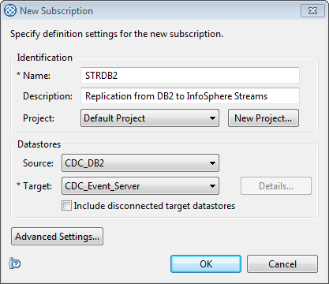

### Select source table
Map a table from source to target, select "Custom" for mapping an individual table (recommended) and choose Standard mapping type

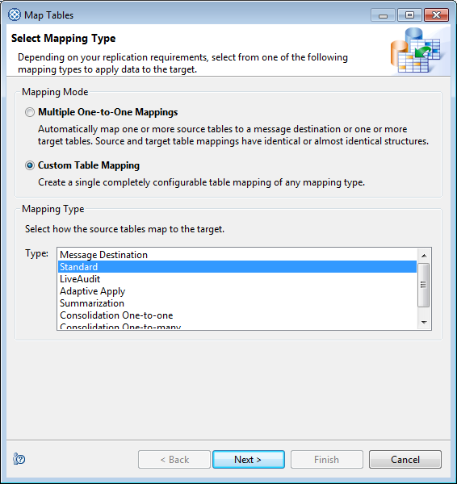

Select the source table for which DML operations must be replicated to your Streams application.

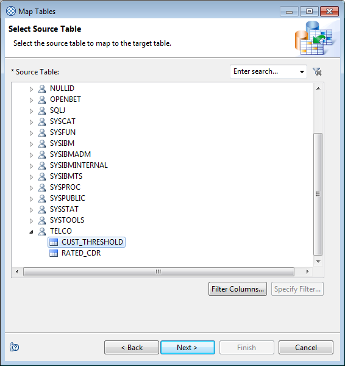

### First time only: create dummy target table
Effectively you only need one target table for all table mappings; the CDC user exit prevents changes from being written to the selected target table and only uses the source columns to replicate to the user exit. Create a "dummy" target table the first time you map a table to Streams and re-use this target table for all mappings.
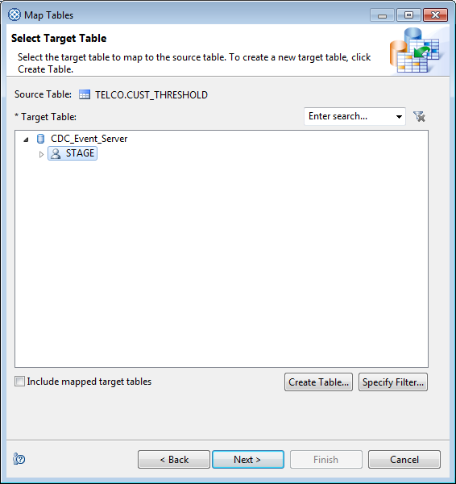
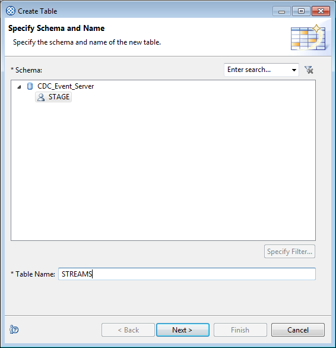
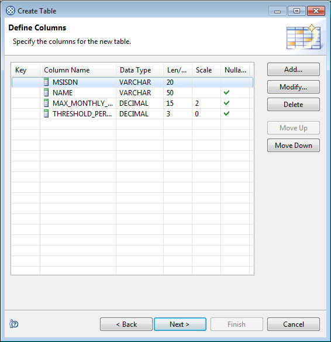
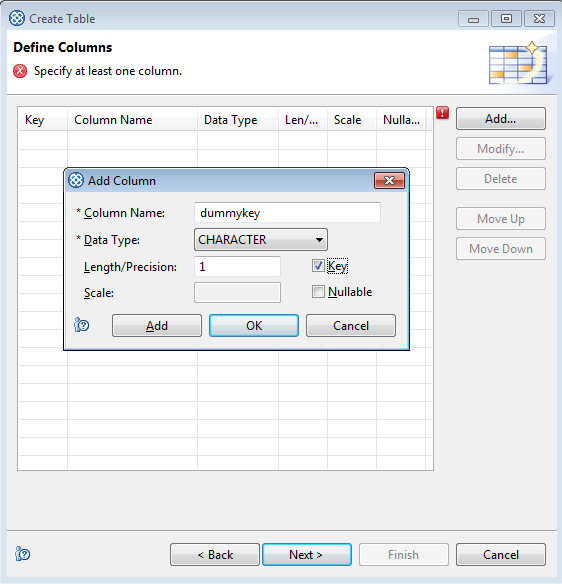
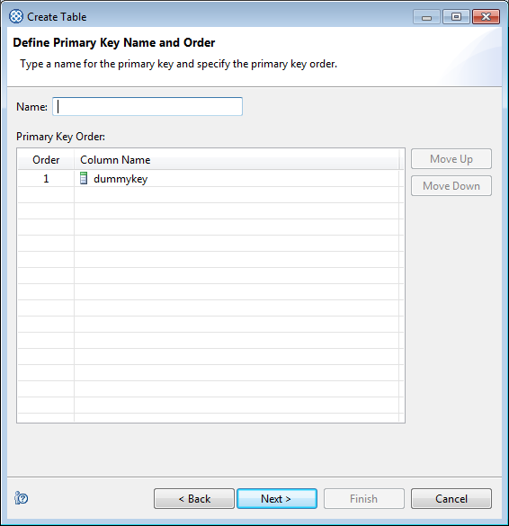


### Select the target table
Select the target table and specify the key. **Note:** If you have already mapped a table in this subscription, and you want to use only 1 "dummy" target table, you have to check the "Include mapped target tables" checkbox to see the `CDCSTREAMS` target table

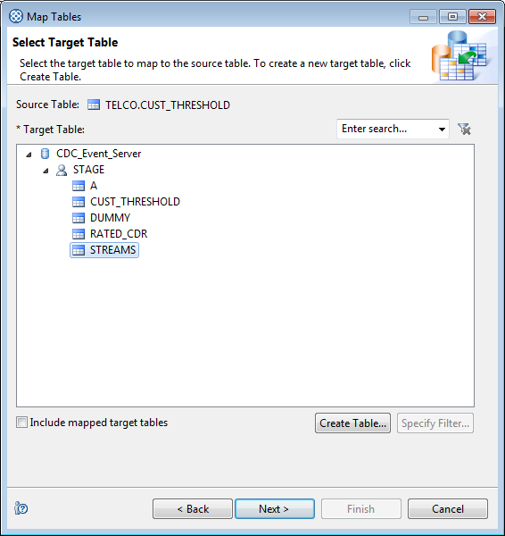
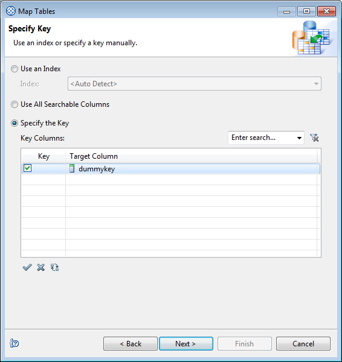

### Set replication method
Set the replication method to Mirror.

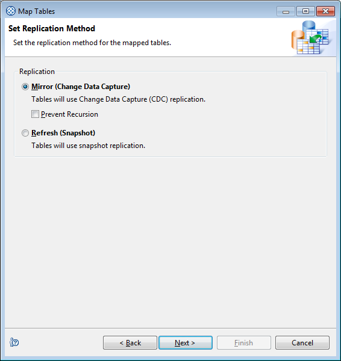

Review the mappings and confirm the mapping of the source table.

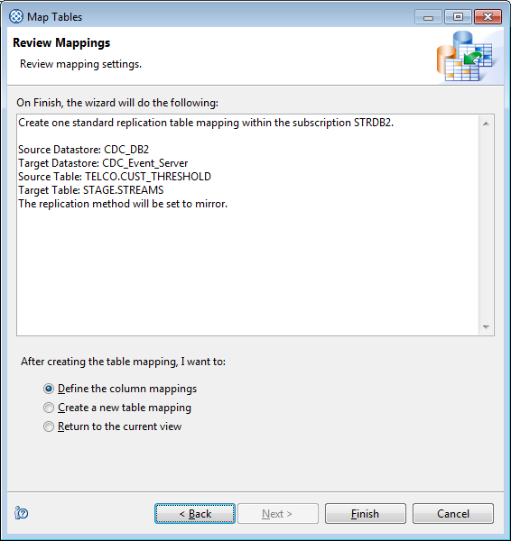

### Set table-level user exit
When the table has been successfully mapped, specify `com.ibm.replication.cdc.streams.CDCStreams` as the user exit for the "before insert", "before update" and "before delete" actions.

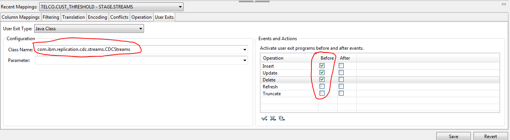

Dependent on the target engine, the replication status will be set to either Refresh or Active. Please ensure that you select the proper replication status, dependent whether you want all records to be sent to the Streams application at the start of the subscription, or only replicate the changes from this moment on.

#### Optional: Set parameters for user exit
The table-level user exit accepts 2 optional parameters: `txTableName` and `fixColumns`.

If you are using CDC Event Server as the target engine, in some configurations the table name may not be provided to the user exit and the subscription will stop with an error. To avoid this error, you can manually provide the fully qualified table name by setting a parameter for the user exit, for example: `txTableName=TELCO.CUST_THRESHOLD`

When some of the source columns contain carriage returns or line feeds or the separator character you have chosen, your Streams application may fail to process the records and issue an error (ArrayOutOfBoundsException), or even transform the input into incorrect data. With the `fixColumns` parameter you can specify which columns must be checked for the existence of a carriage return, line feed or separator character and then replaced by a substitution character that is specified in the properties file. Example: `fixColumns=MSISDN,NAME`

### Set subscription-level user exit (one time only)
Once at least one table has been mapped, right-click the subscription and select "User Exit". Subsequently specify `com.ibm.replication.cdc.streams.CDCStreams` as the user exit name.

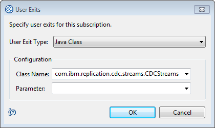

#### Optional: Configure properties file to be used for this subscription
You can optionally specify the name of the properties file that this subscription will use, this to obtain the host and port that the Streams application listens on, and specify other settings. If no parameter is specified, the user exit will find the default properties file `CDCStreams.properties` in the classpath of the CDC engine (and thereby find it in the `CDCStreamsUserExit` folder). If the properties file cannot be found in the classpath, the engine's current directory (_cdc-home_) will be searched

### Creating your Streams application
You can create your Streams application by creating a SPL Application Project in Streams Studio, making sure that the  `Dependencies` include the `com.ibm.streamsx.cdc` toolkit. Alternatively, you can import one of the sample applications that are provided as part of the CDC toolkit through File --> Import --> Sample SPL Application.

Two sample applications have been provided as part of the toolkit, `CHCCLPSample` and `ExportedXmlSample`. Both applications receive changes via the `CDCSource` operator, then use a `Split` operator to direct the raw tuples to the designated `CDCParse` operator, after which the output is sent to `/dev/stdout`.

`CHCCLPSample` application:


The `CDCSource` operator starts a TCP/IP listener, listening on port `12345`:


```
   stream<cdcDataT> Ingest = CDCSource()
     {
       param
         port : 12345 ;
     }
```

CDCSource requires the output tuple type to be `cdcDataT`, which separates the metadata into a `cdcMetadataT` tuple type from the `data`.

```
type cdcMetadataT = rstring txTableName, rstring txTimestamp, rstring txId,
	rstring txEntryType, rstring txUser ;
type cdcDataT = cdcMetadataT cdcMetadata, rstring data;
```
Subsequently, the `Split` operator directs the raw tuples to the designated output port. The output port is dynamically determined from the `etc/TableMapping.txt` file.

```
		(stream<cdcDataT> SplitCustThreshold ; stream<cdcDataT> SplitRatedCdr) =
			Split(Ingest)
		{
			param
				file : "etc/TableMapping.txt" ;
				key : txTableName ;
		}
```

These are the contents of the `etc/TableMapping.txt` file:

```
default,-1
"\*\*\*INITIALIZE\*\*\*",0,1
"TELCO.CUST_THRESHOLD",0
"TELCO.RATED_CDR",1
```
Data tuples from the `TELCO.CUST_THRESHOLD` table are directed to output port 0 and those from `TELCO.RATED_CDR` go to output port 1. A special tuple type, `\*\*\*INITIALIZE\*\*\*` is directed to both output ports. This tuple is sent by the `CDCStreams` user exit when the subscription is started and the `CDCParse` operator uses this (re-)read the table mapping metadata from CDC.

The application provides 2 `CDCParse` operators, one for tuples coming from `TELCO.CUST_THRESHOLD` and another one for `TELCO.RATED_CDR`.

```
		stream<cdcMetadataT cdcMetadata, rstring MSISDN, rstring NAME,
			rstring MAX\_MONTHLY\_CHARGE, rstring THRESHOLD_PERCENTAGE>
			ParseCustThreshold = CDCParse(SplitCustThreshold)
		{
			param
				separator : "\\|" ;
				accessServerConnectionDocument : "etc/AccessServerConnection.xml" ;
				dataStore : "CDC_DB2" ;
				subscription : "STRDB2" ;
				qualifiedTableName : "TELCO.CUST_THRESHOLD" ;
				fillDeleteAfterImage : true ;
		}
```


## Troubleshooting
If you have issues replicating database transactions to your Streams application, you can validate the correct working of individual components.

### Check the CDC event log and instance log messages
If the CDCStreams user exit cannot post messages to the Streams applications, or if the subscriptions has not been configured correctly, error messages are issued in the subscription's target event log. You can find additional detailed messages in the instance log file (under _cdc-home_/instance/_instance_/log). Optionally, activate debugging for the user exit by setting debug=true in the CDCStreams.properties configuration file.

### Testing the CDCStreams user exit
The easiest way to validate that the CDCStreams user exit generates the correct data is by targeting a TCP/IP listener process that is started through the netcat tool. 
* Change the CDCStreams.properties file and specify "tcpsource" for the outputType property 
* Subsquently specify <host>:<port> (for example localhost:12345) for the tcpHostPort property
* Once finished, start a netcat listener on the server you specified in the tcpHostPort property, for example: nc -l 12345
* Start the CDC subscription. As soon as the subscription starts, it will first send an initialization entry to the listener. Optionally make some database changes to see them appear in the netcat listener
* If no messages are received by the netcat listener, check the CDC instance log file (under _cdc-home_/instance/_instance_/log) for errors

### Testing the Streams operators


